  

  
  
  

 

I build backend systems in **Java and Spring Boot** — the kind that ingest a lot of data, store it well and serve it fast. I like the parts most people skip: concurrency, idempotency, caching and what happens when a job fails halfway through.

- 🔭 Building **[Feedless](https://feedless.gg)**, a League of Legends stats site for the Hungarian community
- 🌱 Next up: a maintenance management system for factories
- 💬 Ask me about Postgres job queues, rate limiting, or running a service on a single VPS
- 📍 Pécs, Hungary

 

## 🔭 Feedless

**[feedless.gg](https://feedless.gg)** shows player profiles, leaderboards and champion stats for EUNE and EUW. I designed, built and run the whole system: a crawler that pulls match data from the Riot API, a Java backend that aggregates it, and a Next.js frontend on top.

**Built with** Java 21, Spring Boot 4.1, PostgreSQL 16, Flyway, Redis, Cloudflare R2, Docker Compose, Caddy, GitHub Actions and GHCR, plus Next.js, TypeScript and Tailwind on Vercel.

**The interesting parts**

- **Postgres as a job queue.** Crawler workers claim jobs with `SELECT … FOR UPDATE SKIP LOCKED`, and a scheduled job recovers stale ones, so workers never collide.
- **Dual token-bucket rate limiting** with bucket4j, enforcing Riot's 20 req/s *and* 100 req/2 min limits at the same time.
- **Patch-based partitioning** with a rolling six-patch window. Old data leaves by dropping a partition, not with a slow `DELETE`.
- **Idempotent ingestion** through unique constraints, so re-crawling a match never duplicates it.
- **Raw match JSON archived to Cloudflare R2**, so statistics can be recomputed from source whenever the logic changes.
- Runs on a single Hetzner VPS behind Cloudflare with Full (Strict) TLS, deployed from CI-built container images.

[Live site](https://feedless.gg) · [Source code](https://github.com/USERNAME/feedless)

 

## 🌱 Up next: maintenance management system

A system for factory maintenance teams: machine registry, work orders with a real lifecycle, spare-parts inventory and preventive maintenance, fed by live machine data.

Planned focus: role-based access with Spring Security, a work-order state machine, concurrency-safe spare-part reservations, machine data over MQTT that opens work orders on alarms, and MTBF, MTTR and OEE reporting. It runs against a fully simulated plant.

 

## 🛠️ Other things I build

- **[Calox](https://playcalox.com)**, a sci-fi co-op survival base-builder in Unreal Engine 5, versioned with Perforce Helix Core.
- **A multiplayer tactical FPS** in Unreal Engine 5, with a mixed C++ and Blueprint architecture and listen-server networking.
- **KAPUŐR**, a garage-door code lock built from scratch: firmware, a custom PCB designed in KiCad, and 3D-printed enclosures generated with Python macros in FreeCAD.

 

## 🧰 Tech stack

**Backend and infrastructure**

**Frontend, desktop and games**

